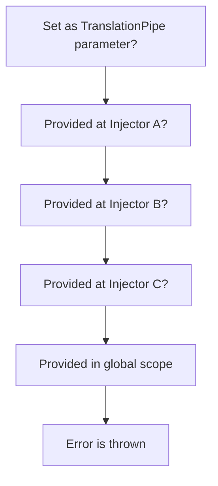

# Define a scope

## Meaning

Scope are logical groups of translations and they can be used to lazy-load your translations and not making your application severly slow. Especially in large enterprise-ready applications, where tons of million translation could coexist.

Each translation should be assigned to one scope. One scope can be applied to many translations.

If a translation has no scope assigned, the translation is in some virtual scope named global scope.

It is up to you and your team to find a paradigm for your scope namings.

## Resolution

Scope resolution is done by specificity. A good example would be [CSS specificity](https://developer.mozilla.org/en-US/docs/Web/CSS/Guides/Cascade/Specificity), as CSS rules apply by importance; just like our translation scopes.

Each scope is provided as an `InjectionToken`. We use `InjectionToken`s, because we can represent specificity trough Angular's `Dependency Injection`.

> In general, we can define a rule for it:
> **The nearest, to the translation provided, scope is the most important and will be prioritized over others**

To visualize the resolution, we provide you the following diagram. Keep in mind, that trough Angular's Dependency Injection, providers can be overriden at any possible `Injector`-level in their Injector hierarchy, so be careful to not provide scopes at too many levels. Otherwise debugging scopes may take a while.

Another small thing to notice: Scopes can be overriden by passing the `scope`-Parameter to `TranslationPipe`.



If you can answer any question with yes, then you know where your scope is provided.

## Example

Imagine an application as following:

```typescript [example.module.ts]
import { NgModule } from "@angular/core";
import { TranslationModule, provideTranslationScope } from "@ogs-gmbh/ngx-translate";

@NgModule({
  imports: [
    TranslationModule.forChild(
      myTranslationConfig
      // Follow our other guide on this
    )
  ],
  providers: [
    provideTranslationScope("my-module-scope")
  ]
})
export class AppModule {}
```

```typescript [example.component.ts]
import { Component } from "@angular/core";
import { provideTranslationScope } from "@ogs-gmbh/ngx-translate";

@Component({
  providers: [
    provideTranslationScope("my-component-scope")
  ],
  template: `
    <p>
      {{ "Example sentence..." | translate :  "my-translation-token" : "my-pipe-scope" }}
    </p>
  `
})
export class AppComponent {}
```

The scope resolution in this example while applying specificity would be:

1. Pipe recieved scope: `my-pipe-scope`
2. If pipe has not recieved any scope, Component `AppComponent` recieved scope: `my-component-scope`
3. If Component `AppComponent` has not recieved any scope, NgModule `AppModule` recieved scope: `my-module-scope`
4. If NgModule `AppModule` has not recieved any scope, the scope is considered global (=`null`)
5. If the global scope doesn't include the translation, an error is thrown
